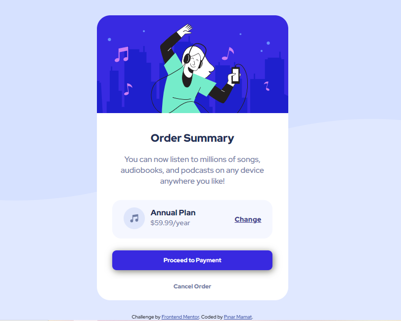

# Frontend Mentor - Order summary card solution

This is a solution to the [Order summary card challenge on Frontend Mentor](https://www.frontendmentor.io/challenges/order-summary-component-QlPmajDUj). Frontend Mentor challenges help you improve your coding skills by building realistic projects. 

## Table of contents

- [Overview](#overview)
  - [The challenge](#the-challenge)
  - [Screenshot](#screenshot)
  - [Links](#links)
- [My process](#my-process)
  - [Built with](#built-with)
  - [What I learned](#what-i-learned)
- [Author](#author)

## Overview

### The challenge

Users should be able to:

- See hover states for interactive elements

### Screenshot




### Links

- Solution URL: [Add solution URL here](https://your-solution-url.com)
- Live Site URL: [Add live site URL here](https://your-live-site-url.com)

## My process

### Built with

- Semantic HTML5 markup
- CSS custom properties
- Flexbox

### What I learned
I learned new things about responsive design that I hadn't noticed in previous projects.


```css
 @media only screen and (max-width:445px){
    body{
        background-image: url(images/pattern-background-mobile.svg);
        font-size: 0.6em;
    }
    .container{
        max-width: 87%;
    }
    .annual{
        margin-top: 30px;
        padding: 17px 10px;
    }

    .annual-new{
        margin-top: 9px;
    }

    h1{
        font-size: 1.5em;
    }
    .order p{
        
        font-size: 1.3em;
    }
}

```


## Author

- Frontend Mentor - [@pnrmmt](https://www.frontendmentor.io/profile/pnrmmt)

